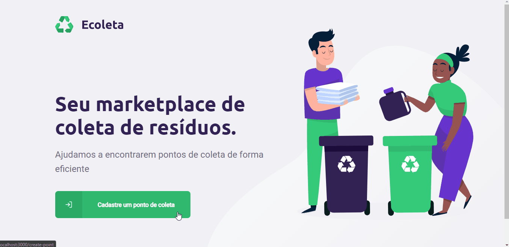

# Ecoleta

    

Projeto criado com a intenção de facilitar a reciclagem, pela criação de pontos de coleta de materiais específicos. Os pontos poderão ser encontrados baseados na localização do usuário.

    

## Contato

* Projeto: [https://github.com/Salt-N-Pepa/Ecoleta](https://github.com/Salt-N-Pepa/Ecoleta)
* GitHub: [https://github.com/Salt-N-Pepa](https://github.com/Salt-N-Pepa)
* LinkedIn: [https://www.linkedin.com/in/alefe-eliel-aaba53158/](https://www.linkedin.com/in/alefe-eliel-aaba53158/)

## Tecnologias

* [Express](https://expressjs.com/pt-br/)
* [SQLite](https://www.sqlite.org/index.html)
* [NodeJS](https://nodejs.org/en/)
* [Typescript](https://www.typescriptlang.org/)
* [React](https://pt-br.reactjs.org/)
* [React Native](https://reactnative.dev/)
* [Knex](http://knexjs.org/)
* [Yarn](https://yarnpkg.com/)